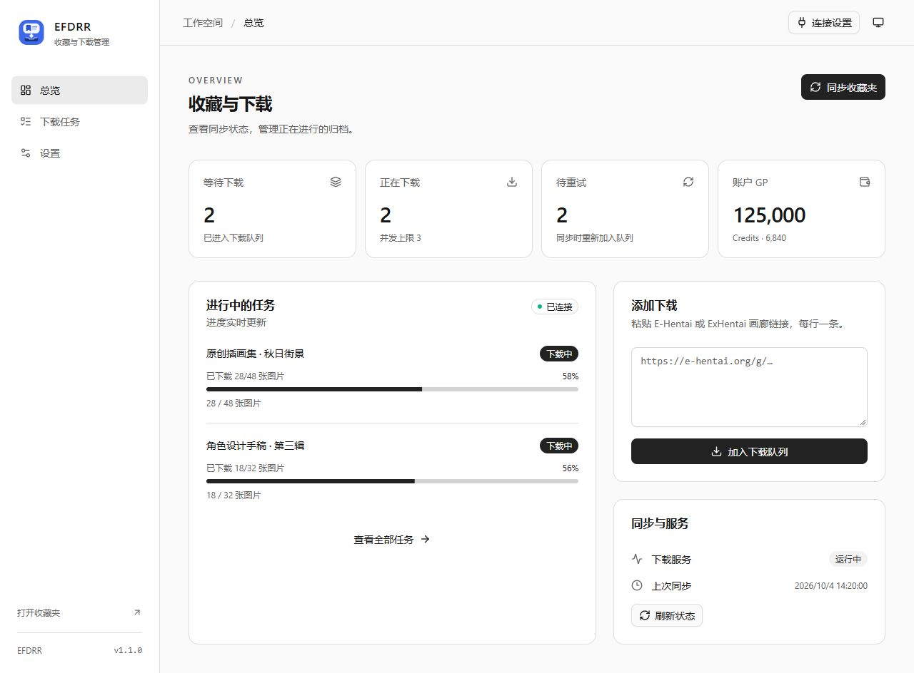
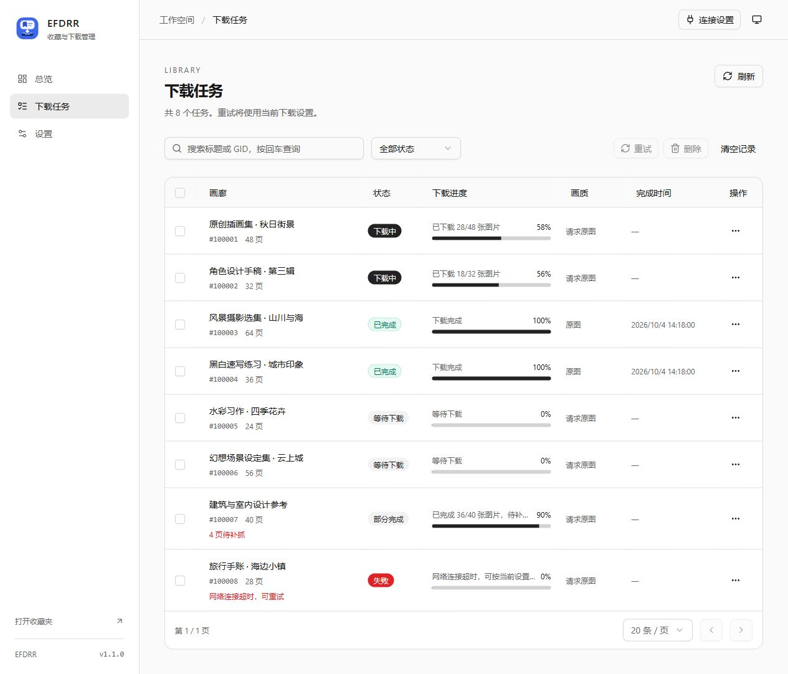
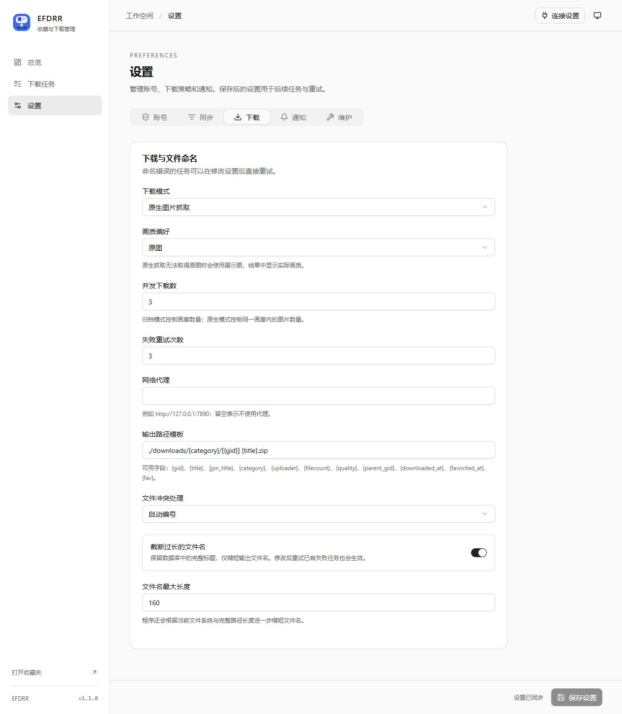

# ehentai_favorites_downloaderRERE

EFDRR 提供 E-Hentai / ExHentai 收藏夹同步、下载队列、断点恢复、实时进度、Telegram 通知和网页控制台。

项目地址：[GitHub](https://github.com/WenHe233/ehentai_favorites_downloaderRERE) · [下载发行包](https://github.com/WenHe233/ehentai_favorites_downloaderRERE/releases)

## 界面预览

### 总览

同步收藏夹、添加下载链接，查看实时进度和队列状态。



### 下载任务

搜索和筛选任务，查看下载结果，批量重试或删除记录。



### 下载设置

设置下载模式、画质、并发数、重试次数和文件命名规则。



## 选择运行方式

| 使用场景 | 选择 |
| --- | --- |
| 桌面单机，使用内嵌窗口和托盘 | GUI 便携包 |
| 服务器、NAS 或通过浏览器管理 | CLI 便携包 |
| Docker / Compose 部署 | GHCR 成品镜像 |

CLI、GUI 都内置后端和网页，无需安装 Python 或 Node.js。Windows x64、Linux x64/arm64、macOS x64/arm64 各提供一个 CLI 和 GUI 包。

文件名示例：`EFDRR-1.1.0-gui-windows-x64.zip`、`EFDRR-1.1.0-cli-linux-arm64.tar.gz`。完整解压后运行，勿单独复制可执行文件。

## GUI 桌面版

- Windows 10/11 x64：运行 `EFDRR.exe`，需要 [WebView2 Runtime](https://developer.microsoft.com/microsoft-edge/webview2/)。
- Linux：运行 `./EFDRR`，支持 Ubuntu 24.04 及兼容环境；随包包含 Qt WebEngine，仍需系统图形库与桌面显示服务。
- macOS 15 及以上：Intel 选择 x64，Apple Silicon 选择 arm64。解压到可写目录，优先运行 `start.command`，也可打开 `EFDRR.app`。

首次启动显示管理员登录信息。关闭窗口可选择退出或进入托盘；没有可用托盘的环境关闭即退出。`--no-tray` 可关闭托盘功能。

数据默认位于解压目录：`config.yaml`、`data/`、`downloads/`。macOS 数据放在 `.app` 外，保留整个解压目录。可以通过 `--data-root` 或 `EFDRR_DATA_ROOT` 指定位置，命令行参数优先。同一数据目录只允许一个实例。

Windows 旧任务栏固定项若指向 Python，请取消固定，再固定新版 `EFDRR.exe`。新版同时设置程序文件、窗口和托盘图标。

## CLI 服务器

```bash
./efdrr-server --host 0.0.0.0 --port 8000 --data-root ./userdata
```

Windows 使用 `efdrr-server.exe`。浏览器打开 `http://服务器地址:8000`，首次密码在指定数据目录的 `config.yaml` 中查看。

| 参数 | 默认值 |
| --- | --- |
| `--host` | `127.0.0.1` |
| `--port` | `8000` |
| `--data-root` | 环境变量指定的位置或程序旁 |
| `--log-level` | `info` |
| `--version` / `--help` | 显示信息并退出 |

Ctrl+C 或 SIGTERM 会停止服务并关闭后台任务。下载器和调度器使用单进程，不要使用多个 Uvicorn worker 共享数据库。

## Docker Compose

镜像：`ghcr.io/wenhe233/ehentai_favorites_downloaderrere:1.1.0`，支持 Linux amd64/arm64。

```bash
cp docker-compose.yml.example docker-compose.yml
docker compose up -d
```

打开 `http://localhost:8080`。Compose 将 `./backend` 挂载到 `/app/userdata`；首次启动自动生成配置，管理员密码位于 `backend/config.yaml`。

单独运行：

```bash
docker run -d --name efdrr --restart unless-stopped \
  -p 8080:8000 -v "$(pwd)/backend:/app/userdata" \
  ghcr.io/wenhe233/ehentai_favorites_downloaderrere:1.1.0
```

升级时修改镜像版本，再运行 `docker compose pull && docker compose up -d`。稳定版也提供 `latest`，提交版本提供 `sha-完整提交SHA`。建议部署固定版本，回退前备份配置和数据。

本地构建：`docker compose -f docker-compose.build.yml.example up -d --build`。

## 文档

- [部署、数据迁移与维护](docs/deployment.md)
- [构建、发布与图标](docs/releasing.md)
- [后端说明](backend/README.md)
- [前端说明](frontend/README.md)
- [REST / SSE API](backend/docs/README.md)

## 本地开发与验证

后端：

```bash
python -m pip install -r backend/requirements.txt -r backend/requirements-dev.txt
cd backend
uvicorn app.main:app --host 127.0.0.1 --port 8000 --reload
```

前端：

```bash
cd frontend
npm ci
npm run dev
```

前端默认同源 `/api/v1`，开发服务器代理到本机 8000。可通过 `VITE_API_BASE_URL` 或控制台连接设置覆盖。

```bash
python -m pytest -q
cd frontend
npm run lint
npm test
npm run build
npx playwright install chromium
npm run test:e2e
```

`VERSION` 是应用版本来源。实际配置、Cookie、数据库、下载与日志均不进入 Git 或发行包。真实账号联调脚本 `scripts/live_acceptance.py` 仅供显式指定样本的本地测试，CI 使用模拟数据。
